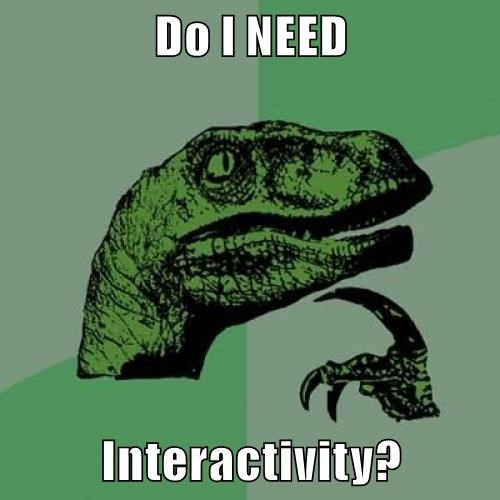
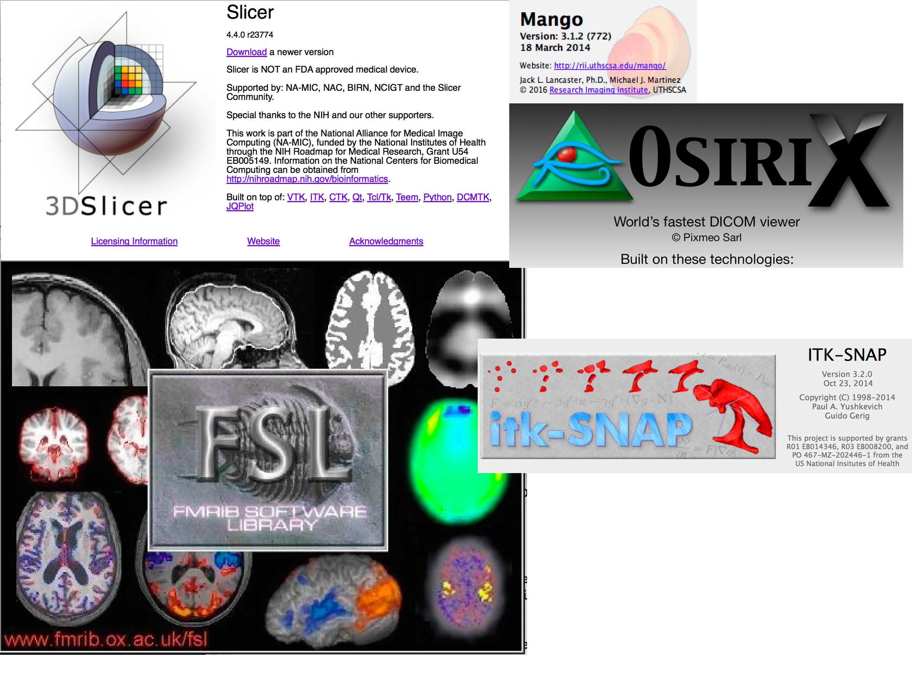

```{r setup, include=FALSE}
knitr::opts_chunk$set(echo = FALSE, 
                      warning = FALSE, 
                      message = FALSE)
```

## Problem: images are 3D: brain

```{r plot}
library(fslr)
library(extrantsr)
library(WhiteStripe)
x = download_img_data()
rm(list = 'x')
img_fname = "reduced_t1.nii.gz"
mask_fname = "reduced_t1_mask.nii.gz"
if (!all(file.exists(c(img_fname,
                       mask_fname)))) {
  t1_fname = system.file("T1Strip.nii.gz", 
                         package = "WhiteStripe")
  img = readnii(t1_fname)
  mask = img > 0
  dd = dropEmptyImageDimensions(mask, 
                                other.imgs = img)
  img = dd$other.imgs
  writenii(img, img_fname)
  mask = dd$outimg
  writenii(mask, mask_fname)
} else {
  img = readnii(img_fname)
  mask = readnii(mask_fname)
}
```

## How big is a brain?

- Image dimensions are: $197\times233\times189$
    - plotting functions are based on `graphics::image` (non-rastered)

```{r wm_seg}
seg_fname = "t1_seg.nii.gz"
if (!file.exists(seg_fname)) {
  res = otropos(a = img, x = mask)
  seg = res$segmentation 
  writenii(seg, seg_fname)
} else {
  seg = readnii(seg_fname)
}
seg_img = seg == 2
writenii(seg_img, "overlay.nii.gz")
i2 = fslswapdim(img, a = "-x")
t2 = fslswapdim(seg_img, a = "-x")
ortho2(i2, add.orient = FALSE)
```

## Explore results: e.g. gray matter segmentation

```{r thresh}
ortho2(i2, t2, add.orient = FALSE, col.y = "green")
```

## Let's make it interactive!

- Are static graphics (e.g. PDFs) good enough?



<p style="font-size: 10pt">image from [http://cheezburger.com](http://cheezburger.com)</p>

## Let's make it interactive!

- Are static graphics (e.g. PDFs/GIFs) good enough?

- What step in the analysis does it come in? For me:
    - exploratory - looking at areas of the brain in processing
      - Asking: "Is this step working?"
      


<p style="font-size: 10pt">http://www.natashaboyd.com/uploads/1/5/5/3/15536518/5572229_orig.gif</p>

## Let's make it interactive!

- Are static graphics (e.g. PDFs/GIFs) good enough?

- What step in the analysis does it come in? For me:
    - confirmatory - check model predictions
      


<p style="font-size: 10pt">http://media.tumblr.com/tumblr_lnlszpEQo21qd8tfx.gif</p>


## But other (standalone) programs can do this!

Also known as "I can do that in X already" 



## Some (of my) principles of interactivity

<div style='font-size: 24pt;'>

1. Should be scriptable to get the interactive **graphic**
    - still hard to script/reproduce the **interaction**
    
2. Should be within the analysis workflow
    - Others are just standalone viewers
    - Relies on fewer systems/dependencies

3. Should be simple for the easy case for the user

</div>


## First attempt: Use manipulate package

<div style='font-size: 26pt;'>

The `manipulate` package [@manipulate] from RStudio can add interactivity:

</div>

```{r, eval = FALSE}
iplot = function(img, plane = c("axial", 
                                "coronal", "sagittal"), 
                 useRaster = TRUE, ...){
  ## pick the plane
  plane = match.arg(plane, c("axial", 
                             "coronal", "sagittal"))
  # Get the max number of slices in that plane for the slider
  ns=  switch(plane,
              "axial"=dim(img)[3],
              "coronal"=dim(img)[2],
              "sagittal"=dim(img)[1])
  ## run the manipulate command
  manipulate({
    image(img, z = z, plot.type= "single",
          plane = plane, 
          useRaster =useRaster, ...)
    # this will return mouse clicks (future experimental work)
    pos <- manipulatorMouseClick()
    if (!is.null(pos)) {
      print(pos)
    }
  },
  ## make the slider
  z = slider(1, ns, step=1, initial = ceiling(ns/2))
  )
}
```


## First attempt: Use manipulate package

<div style='font-size: 26pt;'>

The `manipulate` package [@manipulate] from RStudio can add interactivity, BUT:

- Images rendering was slow (due to the R plotting function)
- Only works with RStudio
- Can't be embedded in document

</div>

## Second attempt: set of PDFs or GIFs!

<div style='font-size: 20pt;'>

The `animation` package [@animation1, @animation2] can make GIFs:


</div>

<div id="wrap">
<div id="left_col" style='font-size: 20pt;'>

Pros:    

- Just plotting with regular functions
    - Can be embedded into an html easily
</div>

<div id="right_col">

Cons: 

- Not really "interactive"
    - less choice on user's end
    - not easy to move back/forward or different view

</div> 


```{r gif, results='hide'}
library(msseg)
library(scales)
outname = "images/slice_movie.gif"
# if (!file.exists(outname)) {
    nz = nsli(i2)
    # n_slices = nz
    n_slices = 20
    probs = seq(1/(n_slices * 2), 
                1 - 1/(n_slices * 2), 
                length.out = n_slices)
    slices = round(quantile(seq(nz), probs = probs))
    slices = unique(slices)
    
    t3 = t2
    t3[t2 == 0] = NA
    t3 = cal_img(t3)
    tstub = tempfile()
    tfile = paste0(tstub, "_%04d.png")
    png(tfile, 
        res = 300, 
        height = 7, 
        width = 7,
        units = "in",
        type = "cairo")
    for (slice in slices) {
      oro.nifti::overlay(x = i2, y = t3, 
              z = slice,
              col.y = alpha("green", 0.5),
              plot.type = "single")
    }
    dev.off()
    png_converter(
      paste0(tstub, "*.png"),
      extra.opts = "-density 300",
      interval = 0.5,
      outname)
# }
```

## papayar R package, port of Papaya JS library

```{r eval = FALSE, echo = TRUE}
library(papayar); papaya(image)
```

<div style="width:70%; height:55%; display: block; margin: auto;">
```{r div, results='asis'}
library(papayar)
x = papaya_div()
cat(x)
```
</div>

## Is it an htmlwidget!? 

<p style="font-size: 140pt; vertical-align: middle; text-align: left;">No</p>


## Is it an htmlwidget!?

<p style="font-size: 140pt; vertical-align: middle; text-align: left;">Not yet.</p>


## Lessons learned

<div style='font-size: 26pt;'>

- Borrow (heavily) other people's stuff
- Porting to R can help the community
    - need some non-R knowledge, usually JavaScript
    - not always so straightforward
    - Functionality at the whim of the JS maintainer
- htmlwidgets framework is great
    - some JS libraries have odd rules
    
</div>

## Bibliography
